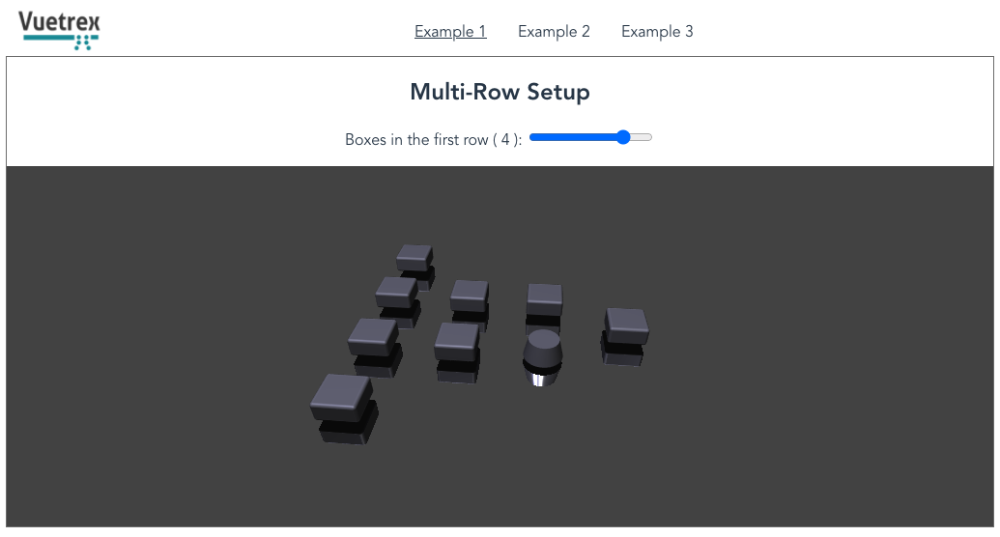

# Vuetrex

WebGL animated diagram visualizations in 3D for Vue 3.x
 
Utilizes [Vue Custom Renderer API](https://v3.vuejs.org/api/global-api.html#createrenderer) and [Three.js](https://threejs.org/)
    
Note: the project is in alpha stage and there could be some changes to the interface.

## For development:

1.  `yarn serve` for development
2.  `yarn build` to rebuild the library

## Usage Example

### ES Module Browser build
For an example using in-browser ES6 modules, see the [tests](tests/iife).

### Using in Vue Project
Use [Vue CLI](https://github.com/vuejs/vue-cli) to set up your project with Vue 3. 

Note: Vuetrex requires Vue 3.0.3 or better and ThreeJS r117+, which is not bundled for convenience.

#### Setup
Install ThreeJS and Vuetrex:
```
npm install three @exceeder/vuetrex
```

#### Usage
In the script section of your .vue component:
```
import {Vuetrex} from "@exceeder/vuetrex";
...
components: {
 Vuetrex
}
```

Vue template example with reactive features fully supported:
```
<template>
 <Vuetrex>
    <layer>
      <row v-if="items.length > 0">
        <box v-for="(el,i) in items" :key="i" :name="'a'+el"/>
      </row>
      <row>
        <box name="b1" size="2"/>
        <box name="b2"/>
      </row>
      <row>
        <box name="c1"/>
        <cylinder name="c2" @click="cylinderClick"/>
      </row>
      <row>
        <box name="d1" size="4"/>
      </row>
    </layer>
 </Vuetrex>
</template>
```

Rendering example:



## [Documentation](docs/README.md)


