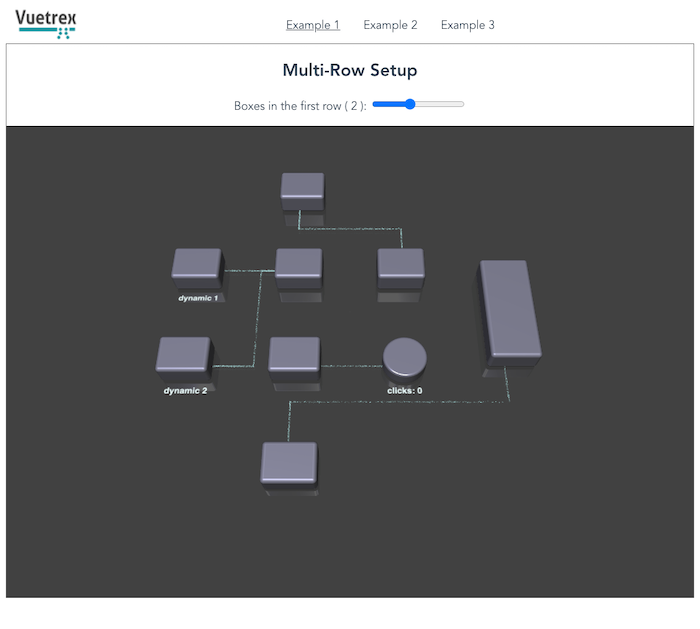

# Vuetrex

WebGL animated diagram visualizations in 3D for Vue 3.x
 
Utilizes [Vue Custom Renderer API](https://v3.vuejs.org/api/global-api.html#createrenderer) and [Three.js](https://threejs.org/)
    
Note: currently in development.

## For development:

1.  `yarn serve` for development
2.  `yarn build` to rebuild  the library

## Usage Example

Setup:
```
npm install @exceeder/vuetrex
```

In script:
```
import {Vuetrex} from Vuetrex;
```

Vue Template (Vue reactive features are fully supported):
```
<template>
 <Vuetrex>
    <layer>
      <row v-if="items.length > 0">
        <box v-for="(el,i) in items" :key="i" :name="'a'+el"/>
      </row>
      <row>
        <box name="b1" size="2"/>
        <box name="b2"/>
      </row>
      <row>
        <box name="c1"/>
        <cylinder name="c2" @click="cylinderClick"/>
      </row>
      <row>
        <box name="d1" size="4"/>
      </row>
    </layer>
 </Vuetrex>
</template>
```

Result:




## TODO
* ~~Fix window resizing~~
* Nesting

