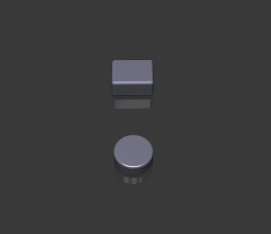
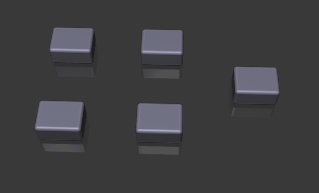
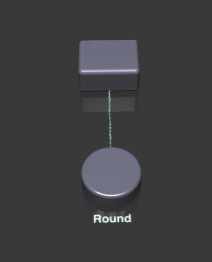

## Introduction

Vuetrex `/vju:treks/` integrates WebGL 3D diagrams into existing Vue UI. It is designed for anyone 
with basic knowledge of Vue. The approach uses the paradigm of html blocks but applies it to 3D space. 
It helps you to skip the complexity of transformations and projections.

Consider an example:

```xml
<template>
  <vuetrex>
    <box/> <cylinder/>
  </vuetrex>
</template>
```

it will render this 



The reactive properties of Vue are preserved, and you can use`v-if`, `v-for`, `@click` events etc., bind
supported attributes, and build out your reactive 3D scene based on your data as you see fit. There is 
a degree of flexibility to adapt the scene to your needs as you go deeper into customization.

## Getting Started

If you don't already have a Vue 3 project, start it with the usual

```
npm install --global @vue/cli
vue create my-vue-project    # choose Vue 3.x, Vue 2.x is not supported
cd my-vue project
```
then add Vuetrex
```
npm install -s @exceeder/vuetrex
```
open `src/components/HelloWorld.vue` and add

```vue
<template>
  ...
  <vuetrex>
    <box />
  </vuetrex>
  ...
</template>
<script>
...
import { Vuetrex } from "@exceeder/vuetrex";

export default {
  components: {
    Vuetrex
  },
...
}
</script> 
```
Run `npm run serve`, open your browser to the suggested url and that's it, you got your first 3d world running.
For a full example, take a look at [this test component](../tests/esm-module/TestApp.vue).

## Layouting

Multiple _rows_:
```vue
 <vuetrex>
    <row>   <box/> <box/>  </row>
    <row>   <box/> <box/>  </row>
    <row>   <box/>         </row>            
  </vuetrex>
```
Rows orientation is from left to right, as if they were rows in the movie theater with the screen on the left side.


Nested _layers_:
```vue
 <vuetrex>
    <row>
       <layer> <box /> <box /> </layer>   
    </row>
    <row> <box/> </row>
    <row>
      <layer>
         <row> <box/> </row>
         <row> <box/> </row> 
      </layer>   
    </row>            
  </vuetrex>
```
Note, that you can use `v-for` to bind elements to your data.

## Connectors and Captions

```vue
 <vuetrex>
    <box name="a"/>
    <cylinder name="b" text="Round" connection="a"/>
  </vuetrex>
```



Connections are particle systems running along the connector lines. Both elements need to have a name 
property to connect.

Caption reflects the text property. Caption text is reactive in case of `:text="prop"` syntax.

## Events

```vue
  <vuetrex>   
    <box :text="'['+counter+']'" @click="counter++"/>
  </vuetrex>
```
as one would expect, in `setup()` you will need a `const counter = ref(0)` that you return in this case.
There is only one possible event `click` at the moment.

## Customization

If you need to dive deeper, you have access to the ThreeJS scene like this:

```vue
<template>
  <vuetrex  @ready="onStageReady">    
    <box text="Example"/>
  </vuetrex>
</template>

<script type="ts">
import {VxStage} from "@exceeder/vuetrex"

export default {
  setup() {   
    function onStageReady(stage: VxStage) {
      //access to THREE.Scene for object loading etc.
      stage.getScene()
      //insert your own animations etc. 
      stage.onEachFrame( (time,tick) => {
        //30 fps frequency
      })
    }
    return {onStageReady} 
  }
}
</script>
```
Check [TabC](../dev/components/TabC.vue) example for advanced customization. This demo 
also extensively uses settings, that you can bind to the `settings` property: 
```
<vuetrex :settings="settings">...</vuetrex> 
...
setup() {
  const settings : VxSettings = {
      unit: 1.25,
      distance: 1.5,
      color: 0x334455,
      highlightColor: 0x3377bb,
      floorColor: 0xffffff,
      captionColor: 0x333333,
      particleColor: 0x707070,
      lightColor1: 0xffffff,
      lightColor2: 0xffffff,
      lightColor3: 0xffffff,
      mirrorOpacity: 0.9,
      particleSpread: 0.1,
      particleVolume: 5
  }
  return {settings}
}
```

