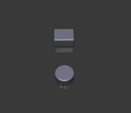

# Introduction

## What is Vuetrex
Vuetrex `/vju:treks/` integrates WebGL 3D diagrams into existing Vue UI. It is designed for anyone
with basic knowledge of Vue. The approach uses the paradigm of html blocks but applies it to 3D space.
It helps you to skip the complexity of transformations and projections.

Consider an example:

```xml
<template>
  <vuetrex>
    <box/> <cylinder/>
  </vuetrex>
</template>
```

it will render this



The reactive properties of Vue are preserved, and you can use`v-if`, `v-for`, `@click` events etc., bind
supported attributes, and build out your reactive 3D scene based on your data as you see fit. There is
a degree of flexibility to adapt the scene to your needs as you go deeper into customization.

## Getting Started

If you don't already have a Vue 3 project, start it with the usual vue CLI

```
npm install --global @vue/cli
vue create my-vue-project    # choose Vue 3.x, Vue 2.x is not supported
cd my-vue project
```
then add Vuetrex
```
npm install -s @exceeder/vuetrex
```
open `src/components/HelloWorld.vue` and add

```vue
<template>
  ...
  <vuetrex>
    <box />
  </vuetrex>
  ...
</template>
<script>
//...
import { Vuetrex } from "@exceeder/vuetrex";

export default {
  components: {
    Vuetrex
  },
//...
}
</script> 
```
Run `npm run serve`, open your browser to the suggested url and that's it, you got your first 3d world running.
For a full example, take a look at [this test component](../tests/esm-module/TestApp.vue).

